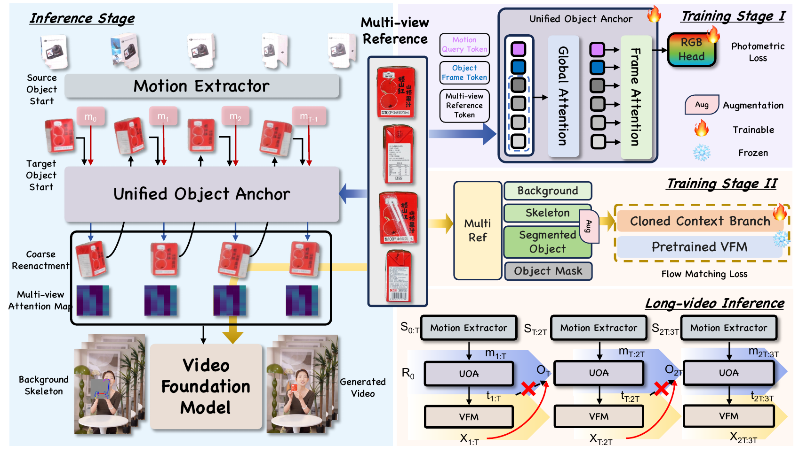

<div align="center">

<!--  -->

<h4 align="center">MVHOI: Bridge Multi-view Condition to Complex Human-Object Interaction Video Reenactment via 3D Foundation Model</h4>

**Jinguang Tong<sup>\*</sup>, Jinbo Wu<sup>\* §</sup>, Kaisiyuan Wang, Zhelun Shen,Xuan Huang, Mochu Xiang, Xuesong Li, Yingying Li, Haocheng Feng, Chen Zhao, Hang Zhou** 

<sup>\*</sup> Equal contribution&nbsp;&nbsp;<sup>✉</sup> Corresponding author&nbsp;&nbsp;<sup>§</sup> Project lead

[](https://arxiv.org/pdf/2603.14686)
<!-- [](https://bernini-ai.github.io/)
[](https://huggingface.co/collections/ByteDance/bernini) -->

</div>

## 🎉 News

- **[2026-06-25]** We open-sourced the inference code and model weights of the **3D part**.
## ✨ Highlights
MVHOI is framework which is the first work bring the 3D prior to video generation model in HOI task.


## 🧾 Models

## 📦 Installation
### Clone Repo
```bash
git clone https://github.com/silence401/MVHOI.git
cd MVHOI
git submodule update --init --recursive thirdparty/DisMo
```

### Setting Environment
```bash
pixi install 
#if you have network problem
# cd pixi_cn & pixi install
pixi shell
```

## 🚀 Usage
### Data Prepare
```text
{data_path}/
├── clips/              # optional content videos
│   └── case000.mp4
├── masks/              # optional content masks
│   └── case000.mp4
├── motion/             # required motion videos
│   └── case000.mp4
├── motion_masks/       # required motion masks
│   └── case000.mp4
├── first_frames/
│   └── case000.jpg
└── multi_views/        # required object reference images
    └── case000/
        ├── front.jpg
        ├── left.jpg
        ├── back.jpg
        └── right.jpg
```

### Inference
```bash
#Modify the infer config
bash src/infer.sh
```
## 📑 Citation

If you use MVHOI in your research, please cite:

```bibtex
@article{mvhoi,
  title   = {MVHOI: Bridge Multi-view Condition to Complex Human-Object Interaction Video Reenactment via 3D Foundation Model},
  author  = {Jinguang Tong and Jinbo Wu and Kaisiyuan Wang and Zhelun Shen and Xuan Huang and Mochu Xiang and Xuesong Li and Yingying Li and Haocheng Feng and Chen Zhao and Hang Zhou and Wei He and Chuong Nguyen and Jingdong Wang and Hongdong Li},
  journal = {arXiv preprint arXiv:2603.14686},
  year    = {2026}
}
```

## 🙏 Acknowledgements

Bernini builds on several outstanding open-source projects:

- [DisMo](https://github.com/CompVis/DisMo)
- [DepthAnything3](https://github.com/ByteDance-Seed/depth-anything-3)
- [RnG](https://github.com/XiangMochu/RnG)

We thank the authors and communities of these projects for their contributions.
<div>
